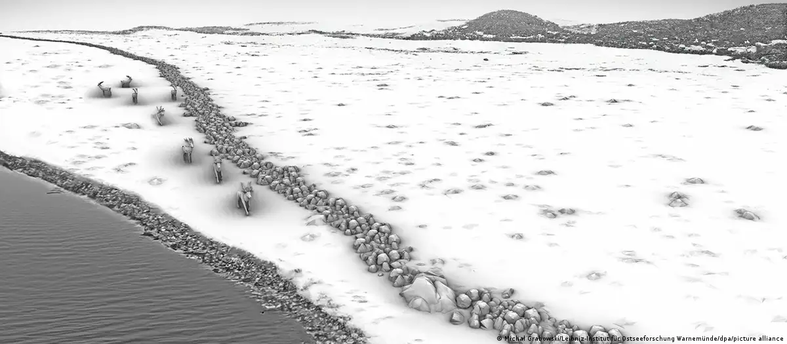

# Reading
collapsed:: true
	- **02:30** [[health]] : [How to fight dementia, according to neurologists](https://www.cnn.com/2024/02/12/health/brain-checkup-wellness/index.html)
	- **02:35** [[journalism]] [[israel-palestine]] : [You should question much of what you read about the war in Gaza](https://thehill.com/opinion/international/4459125-you-should-question-much-of-what-you-read-about-the-war-in-gaza/)
	- **02:38** [[journalism]] [[world]] : [Decolonise How? | Biased Gaza coverage is the tip of a much larger media iceberg](https://www.thenewhumanitarian.org/column/2024/02/12/decolonise-how-biased-gaza-coverage-tip-of-media-iceberg)
	- **02:48** [[art]] : [The Sounds from Auschwitz](https://www.nationalreview.com/corner/the-sounds-from-auschwitz/) re. the movie and its sound track.
	- **08:32** [[environment]]: [It's Confirmed. A Major Atlantic Ocean Current Is Verging on Collapse](https://www.sciencealert.com/its-confirmed-a-major-atlantic-ocean-current-is-verging-on-collapse)
		- {{video https://youtu.be/p4pWafuvdrY?si=UPBGhJrJ1kV30t9R}}
	- **08:41** [[science]]  : [Germany: Ice-age stone wall found under Baltic Sea](https://www.dw.com/en/germany-ice-age-stone-wall-found-under-baltic-sea/a-68243132)
		- Researchers believe they have found the oldest man-made structure in the Baltic Sea region. The wall is believed to be more than 10,000 years old.
		- 
		- This artist's depiction shows what the wall might have looked like before the area was floodedImage: Michał Grabowski/Leibniz-Institut für Ostseeforschung Warnemünde/dpa/picture alliance
	- **08:47** [[justice]] : [The Supreme Court will soon decide whether to sabotage Trump prosecutor Jack Smith - Vox](https://www.vox.com/scotus/2024/2/12/24070539/supreme-court-donald-trump-election-theft-jack-smith-immunity-stay-dc-circuit)
	- **08:50** [[health]] : [Scientists Discover New Telltale Sign of Alzheimer’s](https://scitechdaily.com/scientists-discover-new-telltale-sign-of-alzheimers/)
		- This is interesting to me because I am recognizing more and more signs of decline in myself. [[linda-february-2024]]
	- **08:57** [[Personal]] : [Opinion  In Defense of Saving Everything - The New York Times](https://www.nytimes.com/2024/02/12/opinion/memorabilia-nostalgia.html)
		- It's in the reminiscing, recovery of memories, ...
	- **09:03** [[world]] [[holocaust]] : [A Holocaust museum that predates WWII, London's Wiener Library turns 90 this month  The Times of Israel](https://www.timesofisrael.com/a-holocaust-museum-that-predates-wwii-londons-wiener-library-turns-90-this-month/)
		- In London, the library is staging an exhibition until February 15 about its first nine decades and the remarkable man who founded it.
		- Alfred Wiener, right, circa 1950s. (Wiener Holocaust Library)
		  Wiener’s recognition of the danger posed by the Nazis didn’t begin after Hitler came to power in 1933. Instead, he can justly lay claim to having been one of the first intellectuals to raise the alarm about the rise of antisemitism after World War I.
	- **09:08** [[Personal]] : [True romance how to keep the love alive when sex has gone  Relationships  The Guardian](https://www.theguardian.com/lifeandstyle/2024/feb/13/true-romance-how-to-keep-the-love-alive-when-sex-has-gone)
	- **09:22** [[technical]] : [12 Of The Best Free Notion Templates To Use In 2024](https://www.slashgear.com/1511228/best-free-notion-templates-2024/)
		- Try some of these.
		- Productivity Weekly Planner
		  Subscription Tracker
		  Reading List
		  Recipe Manager
		  StudyOS
		  Timesheet
		  Finance and Budgeting
		  Habit Tracker
		  Personal Media Manager
		  Jobs Dashboard
		  Daily Journal
	- [[world]] : [Russian disinformation distorts American and European democracy](https://www.economist.com/briefing/2018/02/22/russian-disinformation-distorts-american-and-european-democracy)
		- see markdown
	- [[world]] : [France uncovers a vast Russian disinformation campaign in Europe](https://www.economist.com/europe/2024/02/12/france-uncovers-a-vast-russian-disinformation-campaign-in-europe)
		- see markdown
		-
- **11:26** [[spirituality]] :  [Love: The Fire of Transformation — Center for Action and Contemplation](https://cac.org/daily-meditations/love-the-fire-of-transformation-2/)
- **11:26** [[immigration]] :  [‘Utter confusion’ for migrants after crossing the border](https://www.cnn.com/interactive/2024/02/world/migrant-crossing-california-cnnphotos/)
- **23:31** [[history]] [[medicine]] :  
  Michael Servetus (1511-1553) and the Discovery of Pulmonary Circulation
  CHRISTODOULOS STEFANADIS1, MARIANNA KARAMANOU2, GEORGE ANDROUTSOS2
  11st Cardiology Department, 2Department of History of Medicine, Athens Medical School, Athens, Greece
  Michael Servetus was the first doctor ever to challenge and scientifically argue against the theories of Galen, which predominated for 14 centuries in medical schools worldwide. Even though he was relatively correct in scientific terms, Servetus was punished because of his boldness in challenging Galen’s theories and was con- demned to death by the Holy Inquisition. Yet, by publicly challenging Galen’s and Hippocrates’ predominant and unquestionable lessons on medicine for the first time, Servetus opened the door for other doctors to chal- lenge and correct those theories and subsequently to bring about a new view of human anatomy and physiol- ogy. This article underlines the contribution of Servetus to the description of the pulmonary circulation.
-