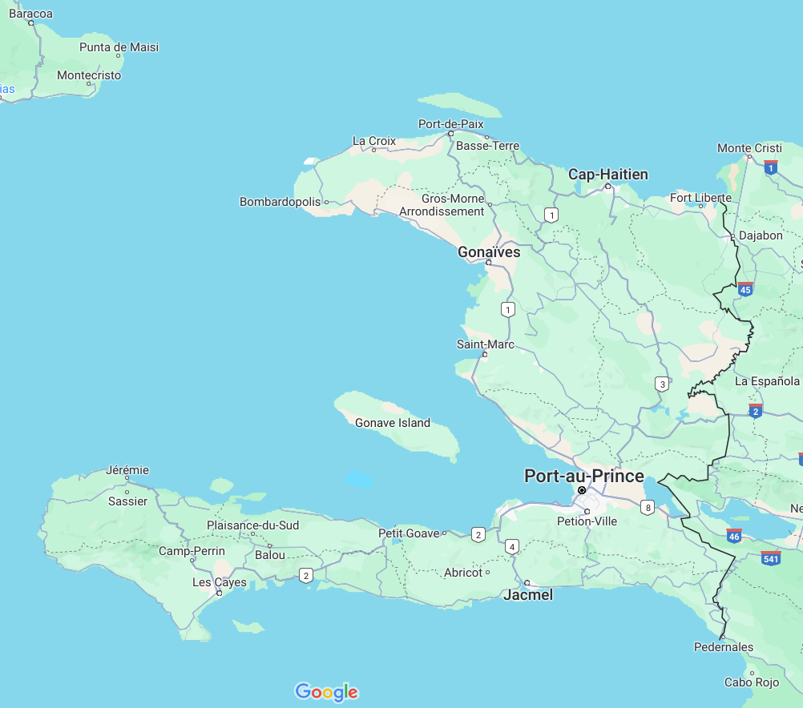

# Readings
	- **15:56** [[trump]] : [How can Donald Trump’s loss-making Truth Social be worth $9bn? | IPOs | The Guardian](https://www.theguardian.com/business/2024/mar/27/how-can-donald-trumps-lossmaking-truth-social-be-worth-8bn "How can Donald Trump’s loss-making Truth Social be worth $9bn? | IPOs | The Guardian")
	- **16:15** [[environment]] : [Anthropocene or not, it is our current epoch that we should be fighting for](https://theconversation.com/anthropocene-or-not-it-is-our-current-epoch-that-we-should-be-fighting-for-225428 "Anthropocene or not, it is our current epoch that we should be fighting for")
	- [[Easter Vigil Draft 1]] worked to end. MP was crying as she said it was the best sermon she had ever read.
	- **16:45** [[my-places]] : [Living abroad, Jim McDermott finds his liberal utopia - Roll Call](https://rollcall.com/2024/03/27/living-abroad-jim-mcdermott-finds-his-liberal-utopia/ "Living abroad, Jim McDermott finds his liberal utopia - Roll Call")
	- **16:52** [[environment]] : [Antarctic sea ice ‘behaving strangely’ as Arctic reaches ‘below-average’ winter peak - Carbon Brief](https://www.carbonbrief.org/antarctic-sea-ice-behaving-strangely-as-arctic-reaches-below-average-winter-peak/ "Antarctic sea ice ‘behaving strangely’ as Arctic reaches ‘below-average’ winter peak - Carbon Brief")
	- **16:54** [[environment]] : [Changes in Antarctica’s glaciers and ice sheets: in pictures | Art and design | The Guardian](https://www.theguardian.com/artanddesign/gallery/2024/mar/25/changes-in-antarcticas-glaciers-and-ice-sheets-in-pictures "Changes in Antarctica’s glaciers and ice sheets: in pictures | Art and design | The Guardian")
	- **18:18** [[environment]] : Antarctica, Earth’s largest refrigerator, is defrosting | The Economist
	- **18:19** [[reading]] [[stories]] [[religion]] [[judaism]] : [Purim’s original queen: How studying the Book of Esther as fan fiction can teach us about the roots of an unruly Jewish festival](https://theconversation.com/purims-original-queen-how-studying-the-book-of-esther-as-fan-fiction-can-teach-us-about-the-roots-of-an-unruly-jewish-festival-218677?utm_medium=email&utm_campaign=Saturday%20Newsletter%20March%2023%202024&utm_content=Saturday%20Newsletter%20March%2023%202024+CID_cefec81663b9681f505a27ae463996f4&utm_source=campaign_monitor_us&utm_term=explains%20the%20surprising%20similarities "Purim’s original queen: How studying the Book of Esther as fan fiction can teach us about the roots of an unruly Jewish festival")
	- **18:21** [[reading]] [[spiritual-direction]] : [When the Story Ends in Death - dhath12@gmail.com - Gmail](https://mail.google.com/mail/u/0/#inbox/FMfcgzGxSRJvtDXrmBQDGzcWkWDwfVzn "When the Story Ends in Death - dhath12@gmail.com - Gmail")
		- Ignatian spirituality email
	- **18:58** [[art]] [[religion]] : [Martin Scorsese to host and produce religious docuseries for Fox News | Martin Scorsese | The Guardian](https://www.theguardian.com/film/2024/mar/27/martin-scorsese-fox-news-docuseries-saints "Martin Scorsese to host and produce religious docuseries for Fox News | Martin Scorsese | The Guardian")
- # Zoom session re. Haiti (Beyond Borders)[[haiti]] [[beyond boarders]] [[world]]
	- Beyond Borders in Port au Prince is now closed because of violence and chaos of the city. Similar to earthquake in 2010.
	- Map
	  collapsed:: true
		- 
	- 150,000 people displaced in the city and environs
	- unreliability electricity is non-existent in most of the city. Lack of fuel. access to cash an issue. fuel used to maintain cell phone towers.
	- access to medical facilities absent. cholera outbreak.
	- the assassinated prime minister was an autocrat. There is some hope that there may be signs of possibility in US that Haiti needs democratic rule.
	- Impact on work of Beyond Borders
		- most of their work is thriving
			- where the work is in rural areas, remote. therefore not where gangs are particularly strong
			- administration in offices in Port au Prince because the workers can come out of neighborhoods
			- don't have hospital, infrastructure. Mission is building social structures for sustainable change. By nature less vulnerable to e.g. gangs
			- who leads the work? staff of courageous, committed, well-connected folks.
	- Smith Maxime director in Haiti.
	- Lot of Beyond Borders on the largest island.
		- survivors organized in different parts of the nation. The organization continues.
	- Emmanuela Douyon: why facing this crisis now?
		- complex. result of so many factors. complicated history. colonial exploitation.
		- had to pay restitution $ to the former colonizers
		- later occupied, political influence
		- half of population live in poverty.
		- wealthy are less than 1%
		- corruption is rampant
		- lack of social cohesion
	- US promoted a model that didn't support Haiti producing its own food. Agribusiness lobbying e.g. under Clinton. (discourage local rice production so that Arkansas growers got a market.)
		- women working in factories of that era encouraged free child labor
		- many of the gang members now were once exploited child laborers
		- US policy complicit with the problems.
			- Narco trafficing
			- arms that are produced in US. heavy weapons are now part of the environment.
	- local people need to show respect for gangs in order to survive
	- Next month "We are family" at BB home page. Register for an event in April 17 (fund raising event) whether giving $ or not we will be uplifted.